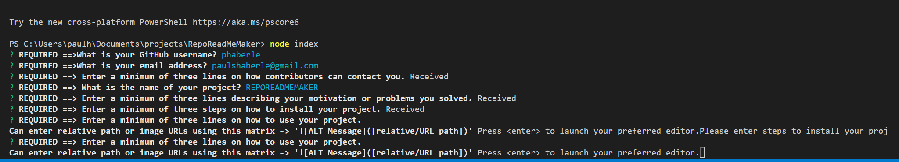
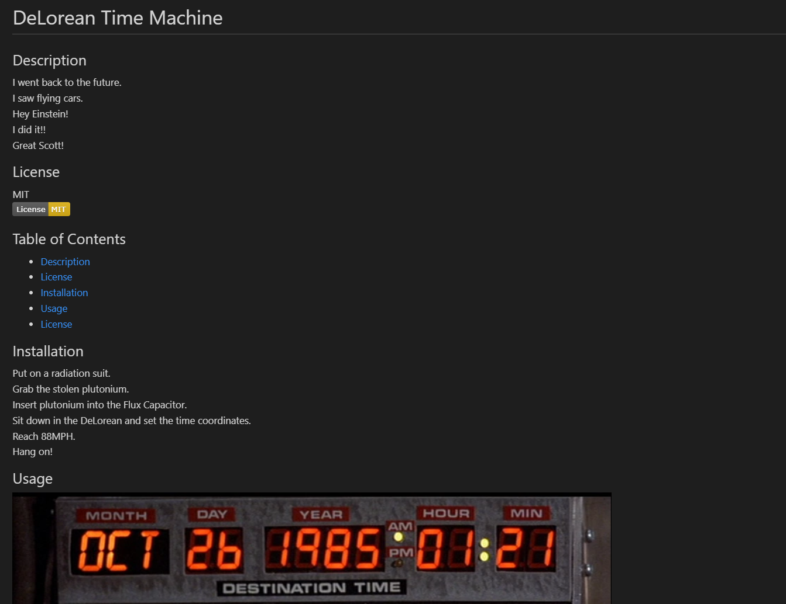

# Repo Read Me Maker

## License
MIT<br>
[](https://opensource.org/licenses/MIT)

## Description
This application uses CLI prompts to complete a survey which will produce a professional README.md file suitable for GitHUB.<br>You get a Title, Description, License, TOC, Installation, Usage, Contribute, Testing, and Question section.<br>It uses JavaScript with inquirer NPM package. Some of these answers require a text editor, so as you answer them, NotePad will show up. From NotePad, edit, save then close window to continue. You can enter markdown syntax for images and links and they will be embedded in the end result.

## Table of Contents
* [Description](#description)
* [License](#license)
* [Installation](#installation)
* [Usage](#usage)
* [License](#license)

## Installation
The dependencies are limited.<br>All that's required is node.js and inquirer.<br>```npm install```

## Usage
[Click do download video demo from iCloud.](https://www.icloud.com/iclouddrive/034j3FWdYrXe_PkbvPic6VBtg#projectDemo)<br>
<br><br>Start: ```node index```<br>Answer the prompts in PowerShell, GitBash or other node-compliant shell. Take all the time you need. There is plenty of room in the text editor to write answers.<br>All of the prompts are required, so there's no skipping. You need to be thorough. Use markdown syntax for embedding,images and code sections.<br>You can use relative paths from within your system.<br>There will instructions on what syntax to use. Don't use HTML. <br>Output is recorded in the project dist folder. Will evaluate whether or not there is a dist folder and create one if it does not exist, so no need to worry about that folder.

## Contribute
Contact me.<br>Email request to be added as contributor.<br>Clone repo.<br>Make PR.

## Testing
At present, there are no TDD tie-ins so -> manual testing. <br>You can use the attached dummy objects in dummy_data.js to seed the form or write files.<br>The dirty object is raw data from inquirer. It has '\\rn\\n +' line endings. These endings mess up markdown. I clean them up with regex to create the cleansed object. <br><br>All you need to do is comment out line 147 - 158 on index.js. <br>Add either of the dummy_data.js objects at the bottom.<br>Copy lines 58-66 from dummy_data.js.<br>Paste into bottom of index.js. <br>Replace object calls to match the dummy object you will be using. <br>Do similar for cleansed object.<br><br>The application uses two files, index.js and tools.js.<br>index is the main file with inquirer and references to tools.<br>tools handles data transformations, creating markdown and outputting the md file.

## Questions
GitHub User Name: phaberle | [This repo](https://github.com/phaberle/RepoReadMeMaker)<br>
Email Address: paulshaberle@gmail.com

### How to reach me with additional questions:
You can contact via email.<br>Find Paul Haberle on [Linkedin](https://www.linkedin.com/feed/).<br>It might take some time for a reply, but I try to answer all inquiries. 
